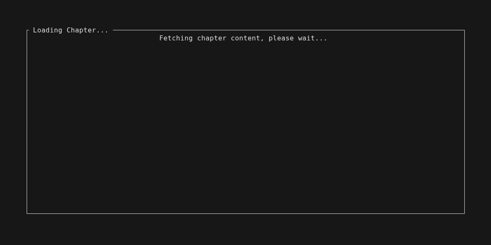

# Scylla Reader

A TUI reader that interfaces with WebAssembly plugins to let you scrape, manage, and read web novels from the terminal. Progress is stored persistently in a local database.


Multiple reading modes:


## Layout

The project contains multiple crates:

- **`scylla-reader/`**: The TUI application.
- **`scylla-plugin-api/`**: Type definitions for plugin developers.
- **`plugin-template/`**: A baseline wasm plugin to help you write new scrapers with Extism.

## Installation

### Option A: Using Nix (Recommended)

#### Temporary

Run once:
```bash
nix run github:MothInBox/scylla-reader
```

Add to your shell temporarily:
```bash
nix shell github:MothInBox/scylla-reader
```

#### Declarative (flake.nix + home.nix)

In your flake inputs:
```nix
scylla-reader = {
    url = "github:MothInBox/scylla-reader";
    inputs.nixpkgs.follows = "nixpkgs";
};
```

Pass `scylla-reader` as a special arg to home-manager, then add to `home.packages`:
```nix
scylla-reader.packages.${pkgs.system}.default
```

### Option B: Using Cargo

**Prerequisites:** Rust stable toolchain, development headers for SSL and curl.

```bash
# Ubuntu/Debian
sudo apt install build-essential pkg-config libssl-dev libcurl4-openssl-dev

# Fedora
sudo dnf groupinstall "Development Tools" && sudo dnf install pkg-config openssl-dev libcurl-devel

# Arch
sudo pacman -S base-devel pkg-config openssl curl

# macOS
brew install openssl curl pkg-config
```

**Compile:**
```bash
git clone https://github.com/MothInBox/scylla-reader.git
cd scylla-reader/scylla-reader
cargo install --path .

# Optional: build the template plugin
cd ../plugin-template
make
```

## Keybindings

### Global
| Key | Action |
|-----|--------|
| `1` | Library |
| `2` | Reader (skip session picker, open most recent) |
| `8` | Jobs |
| `9` | Settings |
| `:` | Command Palette |
| `?` | Toggle Hints |
| `Esc` | Back / Quit / Close Modal |

### Library
| Key | Action |
|-----|--------|
| `i` | Add Book |
| `j` | Jump Chapter |
| `u` | Update All |
| `d` | Delete Book |
| `f` | Cycle Filter |
| `Space` | Cycle Status |
| `Enter` | Session Picker |
| `↑/↓` | Navigate |

### Reader
| Key | Action |
|-----|--------|
| `>` | Next Chapter |
| `<` | Prev Chapter |
| `→` | Next Page (Paged mode) |
| `←` | Prev Page (Paged mode) |
| `↓` | Scroll Down (Scrollable mode) |
| `↑` | Scroll Up (Scrollable mode) |
| `s` | Session Picker |
| `Esc` | Back to Library |

### Settings
| Key | Action |
|-----|--------|
| `↑/↓` | Navigate |
| `Enter` | Select / Edit |
| `Esc` | Back |

### Modals
| Key | Action |
|-----|--------|
| `Esc` | Cancel |
| `Enter` | Confirm / Save |
| `↑/↓` | Navigate |
| `Ctrl+S` | Submit (Add Book) |
| `t` | Toggle Title/URL (Jump Chapter) |
| `n` | New Session |
| `r` | Rename Session |
| `d` | Delete Session |

### Jobs
| Key | Action |
|-----|--------|
| `c` / `C` | Cancel / Cancel All |
| `r` / `R` | Retry / Retry All Failed |
| `f` / `F` | Flush Completed / Flush All |
| `+` / `-` | Increase / Decrease Workers |

## FAQ

### Where can I get plugins?

Develop your own or find one someone else has written.

See the `plugin-template/` directory for a reference implementation.

To test with the template plugin, do:
```
i (open add book window)
type "template"
Ctrl+S (submit)
```

> [!WARNING]
> Plugins run arbitrary wasm on your machine. Verify the plugin yourself or only use trusted sources.

### Where is data stored?

| Directory | Contents |
|-----------|----------|
| `~/.local/share/scylla-reader/` | `library.db` (database) |
| `~/.config/scylla-reader/` | `settings.json`, `plugin-*.json` (config) |
| `~/.config/scylla-reader/plugins/` | `plugin-*.wasm` (plugin binaries) |

## Roadmap

### Recently Completed
- Multiple reading sessions with names
- Persistent settings (rate limit, debug logging, reader mode)
- Word-wrap extracted to separate module
- Plugin config files now use `plugin-` prefix (no collision with `settings.json`)
- Domain matching fixed to use host segments instead of naive substring match
- Plugin cache uses `Mutex` (thread-safe across async boundaries)
- Curl requests have a 30s timeout
- Shared cookie-parsing helper
- Test setup deduplicated across 10 modules

### Planned

- **Plugin explore feed** — in-app browser for discovering books from within Scylla. Plugins expose a browse/search interface, results rendered in the TUI.
- **Plugin download from GitHub** — paste a repo URL, Scylla fetches the wasm and places it in your plugins folder.
- **Customizable file paths** — configure where the database, config, and plugin directories live.
- **HTTPS server** — optional server serving your library as a web UI + API, replacing the earlier daemon/server separation idea.
